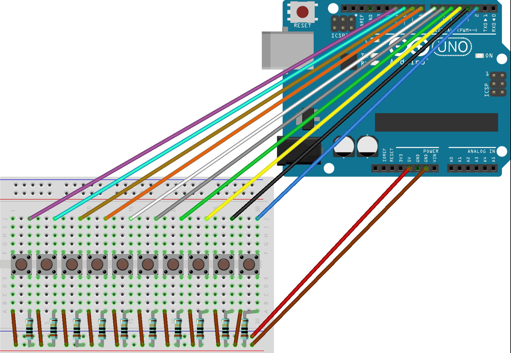
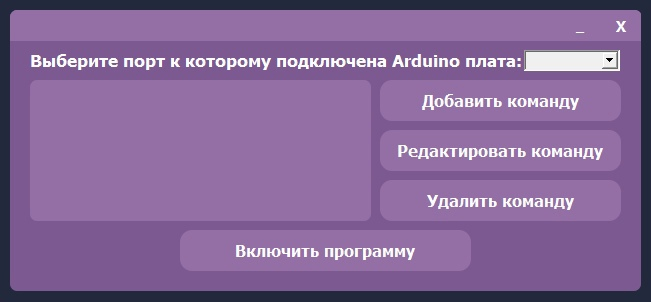

# Arduino Controller
Arduino-Controller - биндер команд для Arduino кнопок через программу.

# Возможности
- Возможность биндить команды (Открывание сайтов/программ) на Arduino кнопки.
- Возможность добавлять свои команды для Arduino кнопки.

# Подготовка Arduino платы к использованию
## Общее
1. Устанавливаем Arduino IDE с их официального сайта: https://www.arduino.cc/en/software;
2. Запускаем Arduino IDE;
## Лёгкий способ
1. Загружаем скетч "StandardFirmata.ino" на Arduino плату, который находиться к корневой папке проекта
2. Arduino плата готова к использованию для программы;
## Посложнее способ (Если "Лёгкий способ" выдаёт ошибку!)
1. Переходим по пути "Файлы -> Примеры -> Firmata -> StandardFirmata" и загружаем скетч на Arduino плату;
2. Arduino плата готова к использованию для программы;
## Само проектирование платы


# Установка и использование программы
1. Устанавливаем Python 3.9;
2. Устанавливаем и запускаем проект:
```sh
git clone https://github.com/EXG1O/Arduino-Controller.git
cd Arduino-Controller/Arduino_Controller
python main.py (Для Linux: python3 main.py)
```
3. Добавляем бинды на Arduino кнопки;
4. Запускаем программу через кнопку "Включить программу";
5. Наслаждаемся программой! :D

# Демонстрация ПО
## Главное окно:
